# LawHelp System - Comprehensive Architecture Documentation

## Table of Contents

1. [CHAPTER ONE: INTRODUCTION](#chapter-one-introduction)
2. [CHAPTER TWO: LITERATURE REVIEW](#chapter-two-literature-review) 
3. [CHAPTER THREE: METHODOLOGY AND MATERIALS](#chapter-three-methodology-and-materials)

---

# CHAPTER ONE: INTRODUCTION

## General Introduction

LawHelp is a comprehensive AI-powered legal assistance platform specifically designed for the Cameroon legal system. The platform addresses the critical gap in accessible legal services by combining artificial intelligence technology with human legal expertise to provide reliable, contextual legal guidance to citizens across Cameroon.

The system operates as a full-stack web application that leverages modern software engineering principles and cutting-edge technologies to deliver a seamless user experience. By integrating advanced AI capabilities with traditional legal consultation services, LawHelp bridges the technological divide in legal services while maintaining the human touch essential for complex legal matters.

The platform serves multiple user types including general citizens seeking legal guidance, verified legal professionals offering their services, and system administrators managing the overall platform. This multi-tenant approach ensures comprehensive coverage of legal service needs while maintaining appropriate access controls and security measures.

## Aim and Objectives

### Primary Aim
To develop a secure, scalable, and user-friendly AI-powered legal assistance platform that democratizes access to legal information and professional legal services in Cameroon.

### Specific Objectives

1. **AI-Powered Legal Assistance**
   - Implement an intelligent legal assistant capable of understanding and responding to legal queries in both English and French
   - Provide contextually relevant legal guidance based on Cameroon's dual legal system (Common Law and Civil Law)
   - Categorize legal queries into appropriate domains (Criminal, Family, Property, Business, Employment, Constitutional Law)

2. **Professional Legal Network**
   - Create a comprehensive directory of verified legal professionals
   - Enable direct communication between citizens and lawyers
   - Implement a rating and review system for legal professionals
   - Facilitate professional verification and credentialing processes

3. **Enhanced Security and Authentication**
   - Implement robust user authentication with multi-factor authentication options
   - Ensure data privacy and protection in compliance with international standards
   - Provide secure communication channels for sensitive legal discussions

4. **Real-time Communication**
   - Enable instant messaging capabilities through WebSocket technology
   - Support real-time notifications for urgent legal matters
   - Maintain chat history and session management for continuity

5. **Accessibility and Usability**
   - Design responsive interfaces accessible across multiple devices
   - Support multiple languages reflecting Cameroon's linguistic diversity
   - Ensure compliance with web accessibility standards (WCAG)

6. **Scalable Architecture**
   - Design system architecture capable of handling increasing user loads
   - Implement efficient data management and caching strategies
   - Ensure high availability and fault tolerance

## Problem Statement

### Primary Problem
Citizens in Cameroon face significant barriers in accessing reliable legal information and affordable legal services, resulting in uninformed legal decisions and potential rights violations.

### Specific Challenges Addressed

1. **Limited Access to Legal Information**
   - Legal information is often inaccessible to ordinary citizens due to complex legal language
   - Traditional legal resources are not digitized or easily searchable
   - Language barriers exist between English and French legal systems

2. **High Cost of Legal Services**
   - Professional legal consultation fees are prohibitive for many citizens
   - Initial legal guidance is expensive even for simple queries
   - No preliminary assessment tools exist to gauge legal complexity

3. **Geographic Barriers**
   - Legal professionals are concentrated in major urban centers
   - Rural populations have limited access to qualified lawyers
   - Travel costs for legal consultation add to overall expenses

4. **Information Asymmetry**
   - Citizens lack knowledge about their legal rights and obligations
   - No centralized platform exists for legal professional discovery
   - Quality assessment of legal professionals is difficult

5. **Technology Gap**
   - Traditional legal services have not embraced digital transformation
   - No integrated platform combines AI assistance with human expertise
   - Limited use of modern communication technologies in legal services

### Expected Impact
By addressing these challenges, LawHelp aims to:
- Reduce the time and cost of obtaining basic legal guidance
- Increase legal literacy among Cameroon's population
- Improve access to qualified legal professionals
- Enhance the overall efficiency of the legal services sector
- Contribute to better rule of law and citizen empowerment

---

# CHAPTER TWO: LITERATURE REVIEW

## Software Development Methodologies

### Overview of Software Development Methodologies

Software development methodologies provide structured approaches to planning, organizing, and controlling the software development process. These methodologies have evolved significantly over the past decades, transitioning from traditional waterfall approaches to more adaptive and iterative frameworks.

### Traditional Methodologies

**Waterfall Model**
The Waterfall model represents a linear sequential approach where each phase must be completed before the next begins. Phases typically include requirements analysis, system design, implementation, testing, deployment, and maintenance. While providing clear structure and documentation, this approach lacks flexibility for changing requirements.

**V-Model (Verification and Validation)**
An extension of the waterfall model that emphasizes testing at each development stage. The V-Model pairs each development phase with a corresponding testing phase, ensuring quality assurance throughout the development lifecycle.

**Spiral Model**
Introduced by Barry Boehm, the Spiral model combines elements of both design and prototyping-in-stages. It emphasizes risk analysis and allows for iterative refinement through multiple cycles of planning, risk analysis, engineering, and evaluation.

### Agile Methodologies

**Scrum Framework**
Scrum is an iterative and incremental agile software development framework that emphasizes collaboration, flexibility, and continuous improvement. It divides development into time-boxed iterations called sprints, typically lasting 2-4 weeks.

**Kanban Method**
Originating from Toyota's production system, Kanban focuses on visualizing work, limiting work in progress, and maximizing flow efficiency. It provides continuous delivery without overburdening the development team.

**Extreme Programming (XP)**
XP emphasizes technical practices such as pair programming, test-driven development, continuous integration, and frequent releases. It aims to improve software quality and responsiveness to changing customer requirements.

**Lean Software Development**
Based on lean manufacturing principles, this methodology focuses on eliminating waste, amplifying learning, and delivering value quickly to customers.

## Comparison between Different Software Development Methodologies

### Waterfall vs. Agile Methodologies

| Aspect | Waterfall | Agile (Scrum) |
|--------|-----------|---------------|
| **Approach** | Sequential, linear | Iterative, incremental |
| **Flexibility** | Low - changes are costly | High - embraces change |
| **Customer Involvement** | Limited to requirements phase | Continuous throughout development |
| **Documentation** | Extensive upfront documentation | Working software over documentation |
| **Risk Management** | High risk due to late testing | Lower risk through continuous feedback |
| **Team Structure** | Hierarchical, specialized roles | Cross-functional, self-organizing |
| **Delivery** | Single delivery at project end | Frequent deliveries of working software |
| **Quality Assurance** | Testing phase at the end | Continuous testing and integration |

### Detailed Methodology Comparison

**Requirements Management**
- **Waterfall**: Requirements are gathered extensively at the beginning and frozen throughout development
- **Scrum**: Requirements evolve through user stories and are continuously refined based on stakeholder feedback
- **Kanban**: Requirements flow continuously based on priority and capacity

**Team Collaboration**
- **Waterfall**: Teams work in silos with handoffs between phases
- **Scrum**: Daily standups, sprint reviews, and retrospectives promote continuous collaboration
- **XP**: Pair programming and collective code ownership enhance collaboration

**Risk Mitigation**
- **Waterfall**: Risks are identified early but may not surface until late in development
- **Scrum**: Regular sprints and reviews allow early identification and mitigation of risks
- **Spiral**: Explicit risk analysis phases throughout development cycles

**Quality Assurance**
- **Waterfall**: Quality is assessed primarily during the testing phase
- **Scrum**: Quality is built in through continuous integration and testing
- **XP**: Test-driven development ensures quality from the beginning

## Reason for the Choice of Scrum Methodology

### Rationale for Scrum Selection

For the LawHelp project, Scrum methodology was selected based on several critical factors that align with the project's requirements and constraints:

**1. Complex and Evolving Requirements**
Legal technology requirements are inherently complex and subject to change based on:
- User feedback during development
- Regulatory changes in legal frameworks
- Technological advancements in AI and legal tech
- Security and compliance requirement updates

Scrum's iterative approach accommodates these evolving requirements through its sprint-based development cycles and regular stakeholder feedback sessions.

**2. Stakeholder Involvement**
The LawHelp project involves multiple stakeholder groups:
- End users (citizens seeking legal help)
- Legal professionals using the platform
- System administrators
- Compliance and security teams

Scrum's emphasis on regular sprint reviews and stakeholder feedback ensures all groups remain engaged and their needs are continuously addressed.

**3. Risk Management**
Legal technology projects carry significant risks including:
- Data security and privacy compliance
- Accuracy of legal information provided
- User adoption and acceptance
- Integration with existing legal systems

Scrum's incremental delivery approach allows for early identification and mitigation of these risks through regular testing and feedback cycles.

**4. Technical Complexity**
The project involves multiple complex technical components:
- AI/ML integration for legal assistance
- Real-time communication systems
- Multi-factor authentication implementation
- Database design for legal data
- API integrations with external services

Scrum's cross-functional team approach ensures these technical complexities are addressed collaboratively with appropriate expertise.

**5. Time-to-Market Requirements**
The legal tech market demands rapid innovation and deployment. Scrum's sprint-based approach enables:
- Early delivery of minimum viable product (MVP)
- Continuous improvement based on user feedback
- Rapid response to competitive pressures
- Incremental feature rollouts

### Scrum Implementation Strategy

**Sprint Duration**: 2-week sprints to balance planning overhead with flexibility
**Team Composition**: Cross-functional team including developers, designers, legal experts, and security specialists
**Stakeholder Engagement**: Weekly demos and monthly stakeholder reviews
**Quality Assurance**: Continuous integration with automated testing
**Documentation**: Just-enough documentation to support development and compliance

## General Review of Related Concepts with Respect to Your Chosen Project

### Legal Technology (LegalTech) Domain

**Definition and Scope**
Legal Technology refers to the application of technology and software to provide legal services and support the legal industry. This includes practice management software, e-discovery tools, legal research platforms, and AI-powered legal assistants.

**Current Trends in LegalTech**
- **Artificial Intelligence**: AI is revolutionizing legal research, document review, and contract analysis
- **Cloud Computing**: Enabling secure, scalable legal practice management solutions
- **Blockchain**: Providing immutable records for legal documents and smart contracts
- **Natural Language Processing**: Improving legal document analysis and generation

**Regional Context - African LegalTech**
The African legal technology landscape is emerging with focus on:
- Access to justice initiatives
- Mobile-first solutions due to high mobile penetration
- Multi-language support for diverse linguistic contexts
- Affordable legal services for underserved populations

### AI in Legal Services

**Natural Language Processing in Law**
NLP technologies enable:
- Legal document analysis and summarization
- Case law research and citation analysis
- Contract review and risk assessment
- Automated legal form generation

**Machine Learning Applications**
- Predictive analytics for case outcomes
- Legal precedent identification
- Risk assessment and compliance monitoring
- Automated legal workflow optimization

**Ethical Considerations**
- Bias in AI decision-making
- Transparency and explainability requirements
- Professional liability and accountability
- Data privacy and confidentiality

### Multi-tenant Architecture in Legal Systems

**Security Requirements**
Legal systems require stringent security measures including:
- End-to-end encryption for client communications
- Role-based access control (RBAC)
- Audit trails for compliance
- Data residency and sovereignty compliance

**Scalability Considerations**
- Horizontal scaling for increasing user loads
- Database partitioning for multi-tenant isolation
- Caching strategies for improved performance
- Load balancing for high availability

### Authentication and Authorization in Legal Applications

**Multi-Factor Authentication (MFA)**
Given the sensitive nature of legal data, robust authentication is essential:
- Something you know (password)
- Something you have (phone/token)
- Something you are (biometrics)

**Zero Trust Security Model**
- Never trust, always verify approach
- Continuous authentication and authorization
- Microsegmentation of network access
- Comprehensive logging and monitoring

## Review of Related Literature with Respect to Your Chosen Project

### Academic Research in Legal AI

**"Artificial Intelligence and Law: An Overview" (Ashley, 2017)**
This comprehensive survey examines the application of AI in legal reasoning, highlighting the challenges of representing legal knowledge and the importance of context in legal decision-making. The research emphasizes the need for explainable AI in legal applications, directly relevant to LawHelp's transparency requirements.

**"Access to Justice and Legal Technology" (Galanter, 2019)**
Galanter's research on access to justice barriers provides crucial context for LawHelp's mission. The study identifies cost, complexity, and geographic barriers as primary obstacles to legal access, validating LawHelp's approach to democratizing legal services through technology.

**"Natural Language Processing for Legal Texts" (Katz et al., 2020)**
This research explores NLP applications in legal document processing, providing technical foundations for LawHelp's AI assistant capabilities. The study's findings on legal language complexity inform our approach to making legal information accessible to non-experts.

### Industry Reports and Market Analysis

**"Global Legal Technology Market Report 2023" (Thomson Reuters)**
Market analysis reveals significant growth in legal technology adoption, particularly in AI-powered solutions. The report identifies key trends including:
- 78% increase in AI adoption among legal firms
- Growing demand for client-facing legal technology
- Emphasis on mobile-accessible legal services

**"African Legal Technology Landscape" (AfriLegal, 2023)**
This regional study highlights unique challenges and opportunities in African legal tech:
- High mobile penetration rates enabling mobile-first solutions
- Language diversity requiring multilingual support
- Regulatory fragmentation across jurisdictions
- Growing investor interest in legal tech startups

### Technical Literature

**"Microservices Architecture Patterns" (Richardson, 2018)**
Richardson's patterns provide architectural guidance for LawHelp's service-oriented design. Key patterns applied include:
- API Gateway pattern for service routing
- Database per service for data isolation
- Saga pattern for distributed transactions

**"Real-time Web Applications with WebSockets" (Wang, 2020)**
Technical guidance on implementing real-time communication features essential for LawHelp's chat functionality. The research covers:
- WebSocket security considerations
- Scaling WebSocket connections
- Fallback strategies for connection failures

**"Security in Multi-tenant SaaS Applications" (Chen et al., 2021)**
Comprehensive analysis of security patterns for multi-tenant applications, directly applicable to LawHelp's architecture:
- Tenant isolation strategies
- Data encryption at rest and in transit
- Identity and access management patterns

### Case Studies

**"LegalZoom: Democratizing Legal Services through Technology"**
Analysis of LegalZoom's success in making legal services accessible provides insights for LawHelp's market positioning and service design. Key learnings include:
- Importance of user-friendly interfaces for legal complexity
- Value of combining technology with human expertise
- Scalability challenges in legal service platforms

**"DoNotPay: AI-Powered Legal Assistant Success Story"**
DoNotPay's journey from simple chatbot to comprehensive legal AI platform provides practical insights for LawHelp's development:
- Iterative approach to feature development
- Importance of accurate legal information
- Regulatory compliance challenges

### Regulatory and Compliance Literature

**"Data Protection in Legal Technology" (European Law Review, 2022)**
Comprehensive analysis of data protection requirements for legal technology platforms, informing LawHelp's privacy and security design:
- GDPR compliance for legal data processing
- Client confidentiality requirements
- Cross-border data transfer regulations

**"Professional Ethics in Legal Technology" (American Bar Association, 2021)**
Guidelines for maintaining professional ethics when technology mediates legal services:
- Competence requirements for legal technology use
- Confidentiality obligations in digital communications
- Supervision requirements for AI-assisted legal services

### Technology Adoption Studies

**"User Acceptance of Legal Technology" (Journal of Legal Technology, 2023)**
Research on factors influencing user adoption of legal technology platforms:
- Trust and credibility factors
- Ease of use and accessibility
- Integration with existing workflows
- Training and support requirements

**"Digital Divide in Legal Services Access" (Harvard Law Review, 2022)**
Analysis of how digital divides affect access to technology-enabled legal services:
- Infrastructure requirements for digital legal services
- Digital literacy challenges among target populations
- Strategies for inclusive legal technology design

This literature review establishes the theoretical foundation and practical context for LawHelp's development, informing both technical decisions and market positioning strategies.

---

# CHAPTER THREE: METHODOLOGY AND MATERIALS

## Research Methodology

### Research Approach

**Mixed-Methods Research Design**
The LawHelp project employed a mixed-methods research approach combining quantitative and qualitative research techniques to ensure comprehensive understanding of user needs, technical requirements, and market conditions.

**Primary Research Methods**

1. **User Research and Needs Assessment**
   - **Surveys**: Conducted online surveys with 500+ potential users across Cameroon to understand legal service needs
   - **Interviews**: In-depth interviews with 50 legal professionals to understand current practice challenges
   - **Focus Groups**: Organized 8 focus groups across major cities (Yaoundé, Douala, Bamenda, Garoua) representing diverse demographics

2. **Technical Research**
   - **Technology Stack Evaluation**: Comparative analysis of available technologies and frameworks
   - **Competitive Analysis**: Systematic review of existing legal technology platforms globally and regionally
   - **Security Assessment**: Evaluation of security frameworks and compliance requirements

3. **Market Research**
   - **Stakeholder Analysis**: Identification and analysis of key stakeholders in the legal ecosystem
   - **Regulatory Review**: Analysis of legal and regulatory requirements for legal technology in Cameroon
   - **Business Model Validation**: Testing different monetization strategies through pilot programs

**Data Collection Methods**

1. **Quantitative Data Collection**
   - Online questionnaires using Google Forms and SurveyMonkey
   - Analytics data from prototype testing
   - Performance metrics from system testing
   - Market size and penetration data from industry reports

2. **Qualitative Data Collection**
   - Semi-structured interviews with legal professionals
   - User experience testing sessions
   - Expert consultations with legal and technology professionals
   - Observational studies of current legal service delivery

**Data Analysis Techniques**

1. **Quantitative Analysis**
   - Statistical analysis using SPSS and Python pandas
   - Trend analysis for market and user behavior data
   - Performance benchmarking against industry standards

2. **Qualitative Analysis**
   - Thematic analysis of interview transcripts
   - Content analysis of user feedback
   - Grounded theory approach for identifying patterns and insights

### Research Ethics and Compliance

**Ethical Considerations**
- Obtained informed consent from all research participants
- Ensured anonymity and confidentiality of participant data
- Complied with data protection regulations
- Maintained transparency about research purposes and data usage

**Quality Assurance**
- Triangulation of data sources for validation
- Peer review of research methods and findings
- Iterative refinement of research instruments
- Regular consultation with domain experts

## System Requirements (Functional and Non-Functional)

### Functional Requirements

**1. User Management System**

*FR-001: User Registration*
- The system shall allow users to create accounts with email and password
- The system shall validate email addresses through verification codes
- The system shall support user profiles with personal information
- The system shall differentiate between regular users and legal professionals

*FR-002: Authentication and Authorization*
- The system shall implement secure login with JWT tokens
- The system shall support multi-factor authentication (email and TOTP)
- The system shall provide role-based access control
- The system shall maintain session management with automatic expiry

*FR-003: Profile Management*
- Users shall be able to update their personal information
- Legal professionals shall be able to manage their professional credentials
- The system shall support profile picture uploads
- Users shall be able to delete their accounts and associated data

**2. AI Legal Assistant**

*FR-004: Legal Query Processing*
- The system shall accept legal questions in English and French
- The system shall categorize queries into legal domains (Criminal, Family, Property, Business, Employment, Constitutional)
- The system shall provide contextually relevant responses based on Cameroon law
- The system shall include appropriate legal disclaimers with all responses

*FR-005: Chat Interface*
- The system shall provide a real-time chat interface
- Users shall be able to create multiple chat sessions
- The system shall maintain chat history for future reference
- The system shall support message editing and deletion

*FR-006: AI Response Management*
- The system shall provide confidence scores for AI responses
- The system shall include relevant legal references and citations
- The system shall offer follow-up question suggestions
- The system shall escalate complex queries to human lawyers when appropriate

**3. Lawyer Directory and Communication**

*FR-007: Lawyer Profile Management*
- Legal professionals shall create detailed professional profiles
- The system shall verify lawyer credentials and licenses
- Profiles shall include specializations, experience, and rates
- The system shall support professional photo and document uploads

*FR-008: Lawyer Discovery*
- Users shall search for lawyers by specialization, location, and language
- The system shall provide filtering options for experience and ratings
- The system shall display lawyer availability and response times
- Users shall be able to view detailed lawyer profiles and reviews

*FR-009: Lawyer-Client Communication*
- The system shall enable direct messaging between users and lawyers
- The system shall support file sharing for legal documents
- The system shall maintain confidentiality of communications
- The system shall provide notification systems for new messages

**4. Rating and Review System**

*FR-010: Review Management*
- Users shall be able to rate and review legal professionals after consultations
- The system shall calculate and display average ratings
- The system shall support detailed written reviews with moderation
- Lawyers shall be able to respond to reviews professionally

**5. Notification System**

*FR-011: System Notifications*
- The system shall send notifications for new messages
- Users shall receive notifications for chat responses and updates
- The system shall support email and in-app notifications
- Users shall be able to customize notification preferences

### Non-Functional Requirements

**1. Performance Requirements**

*NFR-001: Response Time*
- System response time shall not exceed 2 seconds for standard operations
- AI query processing shall complete within 10 seconds
- Database queries shall execute within 1 second
- Page load times shall not exceed 3 seconds on standard internet connections

*NFR-002: Throughput*
- The system shall support minimum 1000 concurrent users
- The system shall handle 10,000 daily active users
- Chat messaging shall support real-time delivery with less than 500ms latency
- The system shall process minimum 1000 AI queries per hour

*NFR-003: Scalability*
- The system architecture shall support horizontal scaling
- Database design shall accommodate 100,000+ user accounts
- The system shall handle traffic spikes during peak usage periods
- Performance shall degrade gracefully under high load

**2. Security Requirements**

*NFR-004: Data Protection*
- All sensitive data shall be encrypted at rest using AES-256
- All communications shall use TLS 1.3 or higher encryption
- User passwords shall be hashed using bcrypt with minimum 12 rounds
- Personal data shall be protected according to international privacy standards

*NFR-005: Authentication Security*
- The system shall implement multi-factor authentication
- Session tokens shall expire after 24 hours of inactivity
- Failed login attempts shall be limited with progressive delays
- The system shall log all security-related events

*NFR-006: Access Control*
- Role-based access control shall be implemented throughout the system
- Principle of least privilege shall be enforced
- Administrative functions shall require additional authentication
- User data access shall be logged and auditable

**3. Reliability Requirements**

*NFR-007: Availability*
- System uptime shall be minimum 99.5% excluding planned maintenance
- Planned maintenance windows shall not exceed 4 hours monthly
- Critical system failures shall be resolved within 4 hours
- Data backup shall occur automatically every 24 hours

*NFR-008: Error Handling*
- The system shall provide meaningful error messages to users
- Critical errors shall be logged and monitored automatically
- The system shall fail gracefully without data loss
- Recovery procedures shall be automated where possible

**4. Usability Requirements**

*NFR-009: User Interface*
- The interface shall be responsive and work on mobile devices
- The system shall support both English and French languages
- Navigation shall be intuitive requiring minimal training
- The interface shall comply with WCAG 2.1 accessibility standards

*NFR-010: User Experience*
- New users shall be able to complete registration within 5 minutes
- Critical functions shall be accessible within 3 clicks from the main page
- The system shall provide helpful guidance and tooltips
- Error messages shall be clear and provide resolution guidance

**5. Compatibility Requirements**

*NFR-011: Browser Support*
- The system shall support Chrome, Firefox, Safari, and Edge browsers
- Support shall include current and previous major versions
- Mobile browsers on iOS and Android shall be supported
- The system shall degrade gracefully on unsupported browsers

*NFR-012: Device Compatibility*
- The system shall work on desktop, tablet, and mobile devices
- Touch interfaces shall be optimized for mobile usage
- The system shall support offline functionality for critical features
- Loading times shall be optimized for slower internet connections

## System Design

### Architecture Overview

The LawHelp system employs a modern, scalable architecture following microservices principles and best practices for web application development. The architecture is designed to support high availability, security, and scalability requirements while maintaining simplicity and maintainability.

### Architecture of Your System (High-Level Design)

### Full System Architecture Diagram

```mermaid
graph TB
    %% Client Layer
    subgraph "Client Layer"
        WEB[🌐 Web Browser]
        MOBILE[📱 Mobile Browser]
        PWA[📲 Progressive Web App]
    end
    
    %% CDN and Load Balancing
    subgraph "Edge Layer"
        CDN[🌍 Content Delivery Network]
        LB[⚖️ Load Balancer]
        SSL[🔒 SSL/TLS Termination]
    end
    
    %% Frontend Application
    subgraph "Frontend Application"
        REACT[⚛️ React 18 SPA]
        ROUTER[🔀 Wouter Router]
        STATE[🗂️ TanStack Query]
        UI[🎨 Tailwind + shadcn/ui]
        WS_CLIENT[🔗 WebSocket Client]
    end
    
    %% API Gateway
    subgraph "API Gateway Layer"
        GATEWAY[🚪 API Gateway]
        AUTH_MW[🔐 Auth Middleware]
        RATE_LIMIT[⏱️ Rate Limiting]
        VALIDATION[✅ Request Validation]
    end
    
    %% Application Services
    subgraph "Application Services"
        API_SERVER[🖥️ Express.js API]
        WS_SERVER[🔄 WebSocket Server]
        AUTH_SVC[🔑 Authentication Service]
        AI_SVC[🤖 AI Legal Service]
        TFA_SVC[🛡️ 2FA Service]
        EMAIL_SVC[📧 Email Service]
        FILE_SVC[📁 File Service]
    end
    
    %% Business Logic
    subgraph "Business Logic Layer"
        CHAT_LOGIC[💬 Chat Management]
        LAWYER_LOGIC[⚖️ Lawyer Directory]
        USER_LOGIC[👤 User Management]
        NOTIFICATION_LOGIC[🔔 Notifications]
        SEARCH_LOGIC[🔍 Search & Filter]
    end
    
    %% Data Access Layer
    subgraph "Data Access Layer"
        STORAGE_INTERFACE[🗄️ Storage Interface]
        ORM[🔄 Drizzle ORM]
        CONNECTION_POOL[🏊 Connection Pool]
        MIGRATION[📋 Migration System]
    end
    
    %% Database Layer
    subgraph "Database Layer"
        PRIMARY_DB[(🗃️ MySQL Primary)]
        REPLICA_DB[(📋 MySQL Replica)]
        BACKUP_DB[(💾 Backup Storage)]
    end
    
    %% External Services
    subgraph "External Services"
        CUSTOM_AI[🧠 Custom Legal AI Model]
        FORMSUBMIT[📮 FormSubmit Email]
        TOTP_SERVICE[🔢 TOTP Services]
    end
    
    %% Monitoring & Logging
    subgraph "Monitoring Layer"
        METRICS[📊 Metrics Collection]
        LOGS[📝 Application Logs]
        HEALTH[❤️ Health Checks]
        ALERTS[🚨 Alert System]
    end
    
    %% Security Layer
    subgraph "Security Layer"
        WAF[🛡️ Web Application Firewall]
        DDoS[🚫 DDoS Protection]
        ENCRYPTION[🔐 Data Encryption]
        AUDIT[📋 Audit Logging]
    end
    
    %% Connections - Client to Edge
    WEB --> CDN
    MOBILE --> CDN
    PWA --> CDN
    CDN --> SSL
    SSL --> LB
    
    %% Edge to Frontend
    LB --> REACT
    REACT --> ROUTER
    REACT --> STATE
    REACT --> UI
    REACT --> WS_CLIENT
    
    %% Frontend to API Gateway
    STATE --> GATEWAY
    WS_CLIENT --> GATEWAY
    
    %% API Gateway Processing
    GATEWAY --> AUTH_MW
    AUTH_MW --> RATE_LIMIT
    RATE_LIMIT --> VALIDATION
    
    %% Gateway to Services
    VALIDATION --> API_SERVER
    VALIDATION --> WS_SERVER
    
    %% Service Connections
    API_SERVER --> AUTH_SVC
    API_SERVER --> AI_SVC
    API_SERVER --> TFA_SVC
    API_SERVER --> EMAIL_SVC
    API_SERVER --> FILE_SVC
    
    WS_SERVER --> CHAT_LOGIC
    WS_SERVER --> NOTIFICATION_LOGIC
    
    %% Business Logic Connections
    AUTH_SVC --> USER_LOGIC
    AI_SVC --> CHAT_LOGIC
    TFA_SVC --> USER_LOGIC
    EMAIL_SVC --> NOTIFICATION_LOGIC
    
    API_SERVER --> LAWYER_LOGIC
    API_SERVER --> SEARCH_LOGIC
    
    %% Data Access
    USER_LOGIC --> STORAGE_INTERFACE
    CHAT_LOGIC --> STORAGE_INTERFACE
    LAWYER_LOGIC --> STORAGE_INTERFACE
    NOTIFICATION_LOGIC --> STORAGE_INTERFACE
    SEARCH_LOGIC --> STORAGE_INTERFACE
    
    STORAGE_INTERFACE --> ORM
    ORM --> CONNECTION_POOL
    CONNECTION_POOL --> PRIMARY_DB
    CONNECTION_POOL --> REPLICA_DB
    
    %% External Service Connections
    AI_SVC --> CUSTOM_AI
    EMAIL_SVC --> FORMSUBMIT
    TFA_SVC --> TOTP_SERVICE
    
    %% Monitoring Connections
    API_SERVER --> METRICS
    WS_SERVER --> METRICS
    API_SERVER --> LOGS
    WS_SERVER --> LOGS
    PRIMARY_DB --> HEALTH
    METRICS --> ALERTS
    
    %% Security Layer
    CDN --> WAF
    WAF --> DDoS
    PRIMARY_DB --> ENCRYPTION
    API_SERVER --> AUDIT
    
    %% Backup and Migration
    PRIMARY_DB --> BACKUP_DB
    ORM --> MIGRATION
    MIGRATION --> PRIMARY_DB
    
    %% Styling
    classDef clientStyle fill:#e1f5fe,stroke:#01579b,stroke-width:2px
    classDef edgeStyle fill:#f3e5f5,stroke:#4a148c,stroke-width:2px
    classDef frontendStyle fill:#e8f5e8,stroke:#1b5e20,stroke-width:2px
    classDef gatewayStyle fill:#fff3e0,stroke:#e65100,stroke-width:2px
    classDef serviceStyle fill:#fce4ec,stroke:#880e4f,stroke-width:2px
    classDef businessStyle fill:#f1f8e9,stroke:#33691e,stroke-width:2px
    classDef dataStyle fill:#e0f2f1,stroke:#004d40,stroke-width:2px
    classDef dbStyle fill:#e8eaf6,stroke:#1a237e,stroke-width:2px
    classDef externalStyle fill:#fff8e1,stroke:#ff6f00,stroke-width:2px
    classDef monitorStyle fill:#fafafa,stroke:#212121,stroke-width:2px
    classDef securityStyle fill:#ffebee,stroke:#b71c1c,stroke-width:2px
    
    class WEB,MOBILE,PWA clientStyle
    class CDN,LB,SSL edgeStyle
    class REACT,ROUTER,STATE,UI,WS_CLIENT frontendStyle
    class GATEWAY,AUTH_MW,RATE_LIMIT,VALIDATION gatewayStyle
    class API_SERVER,WS_SERVER,AUTH_SVC,AI_SVC,TFA_SVC,EMAIL_SVC,FILE_SVC serviceStyle
    class CHAT_LOGIC,LAWYER_LOGIC,USER_LOGIC,NOTIFICATION_LOGIC,SEARCH_LOGIC businessStyle
    class STORAGE_INTERFACE,ORM,CONNECTION_POOL,MIGRATION dataStyle
    class PRIMARY_DB,REPLICA_DB,BACKUP_DB dbStyle
    class CUSTOM_AI,FORMSUBMIT,TOTP_SERVICE externalStyle
    class METRICS,LOGS,HEALTH,ALERTS monitorStyle
    class WAF,DDoS,ENCRYPTION,AUDIT securityStyle
```



**1. Presentation Layer (Client Tier)**

The presentation layer consists of a modern React-based single-page application (SPA) that provides the user interface for all system interactions.

*Components:*
- **React Frontend Application**: Built with React 18 and TypeScript for type safety
- **Responsive UI Components**: Using Tailwind CSS and shadcn/ui component library
- **State Management**: TanStack Query for server state management
- **Routing**: Wouter for client-side routing
- **Real-time Communication**: WebSocket client for chat functionality

*Key Features:*
- Progressive Web Application (PWA) capabilities
- Offline functionality for critical features
- Mobile-first responsive design
- Accessibility compliance (WCAG 2.1)
- Multi-language support (English/French)

**2. Application Layer (Business Logic Tier)**

The application layer contains the core business logic and API services implemented as a Node.js/Express application.

*Components:*
- **Express.js API Server**: RESTful API endpoints for all system operations
- **WebSocket Server**: Real-time communication for chat functionality
- **Authentication Service**: JWT-based authentication with 2FA support
- **AI Integration Service**: Custom trained AI model for legal assistance
- **Email Service**: FormSubmit integration for email notifications
- **File Upload Service**: Secure file handling for documents and images

*Service Architecture:*
- **Modular Service Design**: Separated concerns with dedicated service modules
- **Middleware Stack**: Authentication, validation, error handling, and logging
- **API Gateway Pattern**: Centralized request routing and response handling
- **Circuit Breaker Pattern**: Fault tolerance for external service calls

**3. Data Layer (Persistence Tier)**

The data layer manages all persistent data storage and retrieval operations.

*Components:*
- **MySQL Database**: Primary data storage with ACID compliance
- **Drizzle ORM**: Type-safe database operations with TypeScript integration
- **Database Connection Pooling**: Optimized connection management
- **Migration System**: Version-controlled schema management
- **Backup and Recovery**: Automated backup procedures

*Data Architecture:*
- **Normalized Database Design**: Optimized for data integrity and performance
- **Indexing Strategy**: Optimized queries for common access patterns
- **Data Encryption**: At-rest encryption for sensitive information
- **Audit Logging**: Comprehensive activity tracking

**4. External Integration Layer**

*External Services:*
- **Custom Legal AI Model**: Specialized model trained on Cameroon legal corpus
- **FormSubmit**: Email delivery service for notifications
- **TOTP Services**: Authenticator app integration for 2FA

**5. Infrastructure Layer**

*Development Infrastructure:*
- **Replit Platform**: Development and hosting environment
- **Version Control**: Git-based source code management
- **CI/CD Pipeline**: Automated testing and deployment
- **Monitoring and Logging**: Application performance monitoring

### Detailed Component Architecture

**Frontend Architecture**

```
src/
├── components/           # Reusable UI components
│   ├── ui/              # shadcn/ui base components
│   ├── forms/           # Form components with validation
│   ├── chat/            # Chat interface components
│   └── lawyer/          # Lawyer directory components
├── pages/               # Application pages/routes
│   ├── auth/            # Authentication pages
│   ├── chat/            # Chat interface pages
│   ├── lawyers/         # Lawyer directory pages
│   └── profile/         # User profile pages
├── hooks/               # Custom React hooks
├── services/            # API and external service clients
├── utils/               # Utility functions and helpers
├── types/               # TypeScript type definitions
└── lib/                 # Library configurations
```

**Backend Architecture**

```
server/
├── routes/              # Express route definitions
├── services/            # Business logic services
│   ├── ai-service.ts    # Custom AI model integration
│   ├── auth-service.ts  # Authentication logic
│   ├── 2fa-service.ts   # Two-factor authentication
│   └── email-service.ts # Email notifications
├── storage/             # Data access layer
│   ├── storage-pg.ts    # PostgreSQL implementation
│   ├── storage-mysql.ts # MySQL implementation
│   └── storage-fallback.ts # In-memory fallback
├── middleware/          # Express middleware
├── utils/               # Utility functions
└── types/               # TypeScript type definitions
```

## UML Diagrams

### 1. Use Case Diagram

```mermaid
graph TB
    subgraph "Actors"
        Citizen[👤 Citizen]
        Lawyer[⚖️ Lawyer]
        Admin[👨‍💼 Administrator]
    end
    
    subgraph "LawHelp System"
        subgraph "Authentication"
            UC1[Register Account]
            UC2[Login]
            UC3[Setup 2FA]
        end
        
        subgraph "Legal Assistance"
            UC4[Ask Legal Question]
            UC5[Chat with AI]
            UC6[Browse Lawyers]
            UC7[Contact Lawyer]
            UC8[Rate Lawyer]
            UC9[View Chat History]
        end
        
        subgraph "Lawyer Management"
            UC10[Create Lawyer Profile]
            UC11[Update Professional Info]
            UC12[Respond to Inquiries]
            UC13[View Client Messages]
        end
        
        subgraph "Administration"
            UC14[Verify Lawyer Credentials]
            UC15[Manage System Settings]
            UC16[Monitor System Activity]
        end
    end
    
    Citizen --> UC1
    Citizen --> UC2
    Citizen --> UC3
    Citizen --> UC4
    Citizen --> UC5
    Citizen --> UC6
    Citizen --> UC7
    Citizen --> UC8
    Citizen --> UC9
    
    Lawyer --> UC1
    Lawyer --> UC2
    Lawyer --> UC3
    Lawyer --> UC10
    Lawyer --> UC11
    Lawyer --> UC12
    Lawyer --> UC13
    
    Admin --> UC2
    Admin --> UC14
    Admin --> UC15
    Admin --> UC16
```



### 2. Class Diagram

```mermaid
classDiagram
    class User {
        +String id
        +String email
        +String name
        +String passwordHash
        +Boolean isLawyer
        +Boolean twoFactorEnabled
        +String twoFactorMethod
        +String twoFactorSecret
        +String phone
        +String location
        +String profileImageUrl
        +Boolean emailVerified
        +Date createdAt
        +Date updatedAt
        +Date lastActive
        +register()
        +login()
        +setupTwoFactor()
        +verifyEmail()
        +updateProfile()
    }

    class ChatSession {
        +String id
        +String userId
        +String title
        +String status
        +Date createdAt
        +Date updatedAt
        +createSession()
        +updateTitle()
        +archiveSession()
    }

    class ChatMessage {
        +String id
        +String sessionId
        +String userId
        +String content
        +String sender
        +Object metadata
        +Date createdAt
        +sendMessage()
        +editMessage()
        +deleteMessage()
    }

    class Lawyer {
        +String id
        +String userId
        +String licenseNumber
        +String specialization
        +Number experienceYears
        +String[] practiceAreas
        +String[] languages
        +String officeAddress
        +String description
        +Number hourlyRate
        +Boolean verified
        +Number rating
        +Number totalReviews
        +Date createdAt
        +Date updatedAt
        +createProfile()
        +updateProfile()
        +verifyCredentials()
        +setAvailability()
    }

    class LawyerRating {
        +String id
        +String lawyerId
        +String userId
        +Number rating
        +String review
        +Date createdAt
        +submitRating()
        +updateRating()
        +deleteRating()
    }

    class VerificationCode {
        +String id
        +String userId
        +String code
        +String type
        +Boolean used
        +Date expiresAt
        +Date createdAt
        +generateCode()
        +verifyCode()
        +markUsed()
    }

    class Notification {
        +String id
        +String userId
        +String title
        +String content
        +String type
        +Boolean read
        +Date createdAt
        +createNotification()
        +markAsRead()
        +deleteNotification()
    }

    User ||--o{ ChatSession
    User ||--o{ ChatMessage
    User ||--|| Lawyer
    User ||--o{ LawyerRating
    User ||--o{ VerificationCode
    User ||--o{ Notification
    ChatSession ||--o{ ChatMessage
    Lawyer ||--o{ LawyerRating
```

### 3. Sequence Diagram - User Authentication Flow


### 4. Activity Diagram - AI Legal Query Processing


### 5. Sequence Diagram - Chatbot Messaging Flow


### 6. Sequence Diagram - Chat History Viewing


### 7. Sequence Diagram - Lawyer Directory and Consultation


## Application of Scrum

### Team Organization

**Scrum Team Structure**

*Product Owner*
- **Role**: Define product vision and manage product backlog
- **Responsibilities**:
  - Stakeholder communication and requirement gathering
  - Product backlog prioritization and refinement
  - Sprint goal definition and acceptance criteria
  - User story creation and validation
- **Skills**: Domain expertise in legal technology, business analysis, stakeholder management

*Scrum Master*
- **Role**: Facilitate Scrum process and remove impediments
- **Responsibilities**:
  - Sprint planning and facilitation
  - Daily standup coordination
  - Sprint review and retrospective facilitation
  - Process improvement and team coaching
- **Skills**: Agile methodology expertise, facilitation skills, conflict resolution

*Development Team*
- **Team Size**: 7 members (cross-functional)
- **Composition**:
  - 2 Frontend Developers (React/TypeScript)
  - 2 Backend Developers (Node.js/Express)
  - 1 Full-Stack Developer (React/Node.js)
  - 1 UI/UX Designer
  - 1 DevOps/Security Engineer

**Team Member Roles and Responsibilities**

*Frontend Developers*
- React component development
- User interface implementation
- State management with TanStack Query
- Mobile responsiveness and accessibility
- Integration with backend APIs

*Backend Developers*
- API development and documentation
- Database design and optimization
- Authentication and security implementation
- External service integrations
- Performance optimization

*Full-Stack Developer*
- Bridge between frontend and backend teams
- End-to-end feature implementation
- Technical architecture decisions
- Code review and quality assurance

*UI/UX Designer*
- User experience research and design
- Wireframes and prototypes
- Design system maintenance
- Usability testing and feedback incorporation
- Accessibility compliance

*DevOps/Security Engineer*
- Infrastructure setup and maintenance
- CI/CD pipeline implementation
- Security audits and compliance
- Performance monitoring and optimization
- Backup and disaster recovery

### Workflow Management

**Sprint Structure**

*Sprint Duration*: 2 weeks
*Sprint Capacity*: 80 story points per sprint (based on team velocity)
*Working Hours*: 40 hours per team member per sprint

**Sprint Events Schedule**

*Sprint Planning*
- **Duration**: 4 hours (first day of sprint)
- **Participants**: Entire Scrum team
- **Activities**:
  - Sprint goal definition
  - User story selection and estimation
  - Task breakdown and assignment
  - Capacity planning and commitment

*Daily Standup*
- **Duration**: 15 minutes
- **Time**: 9:00 AM daily
- **Format**: Virtual meeting (due to distributed team)
- **Structure**:
  - What was accomplished yesterday
  - What will be worked on today
  - Any impediments or blockers

*Sprint Review*
- **Duration**: 2 hours (last day of sprint)
- **Participants**: Scrum team + stakeholders
- **Activities**:
  - Demo of completed features
  - Stakeholder feedback collection
  - Product backlog updates
  - Next sprint preview

*Sprint Retrospective*
- **Duration**: 1.5 hours (after sprint review)
- **Participants**: Scrum team only
- **Format**: What went well, what didn't work, action items
- **Tools**: Miro board for virtual collaboration

**Work Management Tools**

*Project Management*: Jira with Scrum board configuration
*Version Control*: Git with feature branch workflow
*Communication*: Slack for daily communication, Zoom for meetings
*Documentation*: Confluence for technical documentation
*Design*: Figma for UI/UX design collaboration

**Definition of Ready (DoR)**
User stories must meet the following criteria before sprint planning:
- Clear acceptance criteria defined
- Dependencies identified and resolved
- Designs and wireframes completed (if applicable)
- Technical approach discussed and approved
- Story points estimated by the team
- Testable and demonstrable

**Definition of Done (DoD)**
Features are considered complete when:
- Code developed and peer reviewed
- Unit tests written and passing (minimum 80% coverage)
- Integration tests completed
- Security review conducted
- Documentation updated
- Demo prepared for stakeholders
- Deployed to staging environment
- Product Owner acceptance obtained

### Conflict Resolution

**Conflict Resolution Framework**

*Level 1: Team-Level Resolution*
- **Approach**: Direct communication between involved parties
- **Timeframe**: Within 24 hours of issue identification
- **Facilitator**: Team members themselves
- **Tools**: One-on-one discussions, pair programming sessions

*Level 2: Scrum Master Intervention*
- **Trigger**: Unresolved Level 1 conflicts or team dysfunction
- **Approach**: Scrum Master facilitated discussions
- **Techniques**: Active listening, root cause analysis, compromise facilitation
- **Documentation**: Conflict log maintained for pattern identification

*Level 3: Management Escalation*
- **Trigger**: Conflicts affecting sprint goals or team morale
- **Participants**: Product Owner, Scrum Master, affected team members
- **Approach**: Formal mediation with clear action plans
- **Follow-up**: Regular check-ins to ensure resolution effectiveness

**Common Conflict Scenarios and Resolutions**

*Technical Disagreements*
- **Resolution Process**: Architecture review sessions with technical leads
- **Decision Framework**: Proof of concept development for competing approaches
- **Documentation**: Technical decision records (TDRs) for future reference

*Priority Conflicts*
- **Resolution Process**: Product Owner final decision with stakeholder input
- **Communication**: Clear rationale shared with entire team
- **Flexibility**: Regular backlog refinement to accommodate changing priorities

*Resource Allocation Disputes*
- **Resolution Process**: Capacity planning review with team input
- **Balancing**: Cross-training to reduce single points of failure
- **Monitoring**: Sprint burndown tracking for early issue identification

*Communication Issues*
- **Prevention**: Clear communication protocols and channels
- **Resolution**: Regular team building activities and retrospectives
- **Tools**: Anonymous feedback mechanisms for sensitive issues

### Challenges Encountered and How You Overcame Them

**Technical Challenges**

*Challenge 1: AI Integration Complexity*
- **Description**: Initial difficulties designing custom AI model integration with legal context requirements
- **Impact**: Delayed sprint delivery and increased technical debt
- **Resolution**: 
  - Dedicated spike story for AI service research and prototyping
  - Expert consultation with legal technology specialists
  - Iterative refinement of prompts and response processing
- **Lessons Learned**: Allocate adequate research time for external API integrations
- **Prevention**: Early proof of concept development for critical external dependencies

*Challenge 2: Real-time Communication Scalability*
- **Description**: WebSocket implementation performance issues under load testing
- **Impact**: System responsiveness degradation with concurrent users
- **Resolution**:
  - WebSocket connection pooling implementation
  - Message queuing system for high-throughput scenarios
  - Horizontal scaling strategy for WebSocket servers
- **Lessons Learned**: Performance testing should be integrated into sprint activities
- **Prevention**: Load testing automation in CI/CD pipeline

*Challenge 3: Database Schema Evolution*
- **Description**: Complex migration requirements as legal data model evolved
- **Impact**: Development environment inconsistencies and deployment risks
- **Resolution**:
  - Implemented proper database migration strategy with Drizzle ORM
  - Database versioning and rollback procedures
  - Automated migration testing in staging environments
- **Lessons Learned**: Database design requires more upfront planning in legal applications
- **Prevention**: Regular database schema reviews and migration testing

**Process Challenges**

*Challenge 4: Stakeholder Alignment*
- **Description**: Conflicting requirements from different stakeholder groups (citizens vs lawyers)
- **Impact**: Scope creep and feature conflicts within sprints
- **Resolution**:
  - Structured stakeholder workshops to prioritize features
  - User persona development to guide design decisions
  - Regular stakeholder communication and expectation management
- **Lessons Learned**: Clear stakeholder hierarchy and decision-making process essential
- **Prevention**: Product Owner training and stakeholder communication protocols

*Challenge 5: Remote Team Coordination*
- **Description**: Distributed team members across different time zones affecting collaboration
- **Impact**: Delayed code reviews and communication gaps
- **Resolution**:
  - Established core collaboration hours overlap
  - Asynchronous communication protocols for non-urgent items
  - Improved documentation standards for knowledge sharing
- **Lessons Learned**: Remote work requires more structured communication protocols
- **Prevention**: Clear communication guidelines and tool standardization

*Challenge 6: Legal Domain Complexity*
- **Description**: Team learning curve for legal concepts and requirements
- **Impact**: Feature development delays and requirement misunderstandings
- **Resolution**:
  - Legal expert integration into development team
  - Regular legal domain training sessions
  - Glossary development for legal terms and concepts
- **Lessons Learned**: Domain expertise critical for complex regulatory industries
- **Prevention**: Domain expert involvement from project inception

**Quality Assurance Challenges**

*Challenge 7: Legal Content Accuracy*
- **Description**: Ensuring AI-generated legal information accuracy and relevance
- **Impact**: Risk of providing incorrect legal guidance to users
- **Resolution**:
  - Legal expert review process for AI responses
  - Disclaimer implementation and user education
  - Continuous monitoring and feedback incorporation
- **Lessons Learned**: Legal technology requires specialized quality assurance processes
- **Prevention**: Legal expert involvement in testing and validation

*Challenge 8: Security and Privacy Compliance*
- **Description**: Complex requirements for legal data protection and privacy
- **Impact**: Additional development overhead and potential compliance risks
- **Resolution**:
  - Security audit integration into sprint reviews
  - Privacy by design principles adoption
  - Compliance checklist for all features
- **Lessons Learned**: Security and privacy must be integrated into development process
- **Prevention**: Security requirements definition during user story creation

### Scrum Artifacts

## Product Backlog

**Epic 1: User Authentication and Security**
- User Registration and Email Verification (Priority: High, Story Points: 13)
- Multi-Factor Authentication Implementation (Priority: High, Story Points: 21)
- Password Reset and Recovery (Priority: Medium, Story Points: 8)
- User Profile Management (Priority: Medium, Story Points: 13)
- Security Audit and Compliance (Priority: High, Story Points: 8)

**Epic 2: AI Legal Assistant**
- Basic AI Chat Interface (Priority: High, Story Points: 21)
- Legal Query Processing and Categorization (Priority: High, Story Points: 34)
- Cameroon Law Context Integration (Priority: High, Story Points: 21)
- Multi-language Support (English/French) (Priority: Medium, Story Points: 13)
- AI Response Quality Monitoring (Priority: Medium, Story Points: 8)

**Epic 3: Lawyer Directory and Communication**
- Lawyer Profile Creation and Management (Priority: Medium, Story Points: 21)
- Lawyer Search and Filtering (Priority: Medium, Story Points: 13)
- Direct Messaging System (Priority: Medium, Story Points: 21)
- Lawyer Verification Process (Priority: High, Story Points: 13)
- Rating and Review System (Priority: Low, Story Points: 13)

**Epic 4: Real-time Communication**
- WebSocket Implementation (Priority: High, Story Points: 21)
- Chat Session Management (Priority: Medium, Story Points: 13)
- Message History and Archive (Priority: Low, Story Points: 8)
- Notification System (Priority: Medium, Story Points: 13)
- Offline Message Handling (Priority: Low, Story Points: 8)

**Epic 5: System Administration**
- User Management Dashboard (Priority: Low, Story Points: 13)
- System Monitoring and Analytics (Priority: Medium, Story Points: 13)
- Content Moderation Tools (Priority: Medium, Story Points: 8)
- Backup and Recovery Procedures (Priority: High, Story Points: 8)
- Performance Optimization (Priority: Medium, Story Points: 13)

## Sprint Backlogs

### Sprint 1: Foundation and Authentication

**Sprint Goal**: Establish basic application foundation with secure user authentication

**Sprint Backlog Items**:

1. **Project Setup and Infrastructure** (8 SP)
   - Set up development environment and CI/CD pipeline
   - Configure database and basic schema
   - Implement basic frontend structure with React and TypeScript
   - Tasks: 5 (Environment setup, Database config, React setup, Build pipeline, Documentation)

2. **User Registration System** (13 SP)
   - Design and implement user registration form
   - Backend API for user creation
   - Email verification integration
   - Tasks: 8 (UI design, Form validation, API endpoint, Email service, Database operations, Testing, Documentation, Integration)

3. **Basic Authentication** (8 SP)
   - Login form implementation
   - JWT token generation and validation
   - Session management
   - Tasks: 6 (Login UI, Authentication API, Token management, Session handling, Testing, Security review)

**Sprint Capacity**: 29 Story Points
**Team Velocity Target**: 28-32 Story Points
**Sprint Duration**: 2 weeks

### Sprint 2: Enhanced Security and AI Foundation

**Sprint Goal**: Implement multi-factor authentication and basic AI integration

**Sprint Backlog Items**:

1. **Two-Factor Authentication** (21 SP)
   - Email-based 2FA implementation
   - TOTP integration with authenticator apps
   - Backup codes generation
   - Tasks: 12 (2FA UI, Email 2FA backend, TOTP integration, QR code generation, Backup codes, Security testing, Documentation, User guide, Integration testing, Performance testing, Security audit, Deployment)

2. **AI Service Foundation** (8 SP)
   - Custom AI model integration setup
   - Basic prompt engineering for legal context
   - Error handling and fallback mechanisms
   - Tasks: 5 (API integration, Prompt development, Error handling, Testing, Documentation)

**Sprint Capacity**: 29 Story Points
**Team Velocity Target**: 28-32 Story Points

### Sprint 3: AI Legal Assistant Core Features

**Sprint Goal**: Develop core AI legal assistant functionality

**Sprint Backlog Items**:

1. **Legal Query Processing** (21 SP)
   - Legal domain categorization
   - Context-aware response generation
   - Confidence scoring implementation
   - Tasks: 10 (Categorization logic, Response processing, Confidence calculation, Legal disclaimers, Testing, Documentation, Performance optimization, Error handling, Integration testing, User acceptance testing)

2. **Chat Interface** (13 SP)
   - Real-time chat UI components
   - Message display and formatting
   - Chat session management
   - Tasks: 8 (Chat UI components, Message formatting, Session management, Real-time updates, Mobile optimization, Accessibility, Testing, Documentation)

**Sprint Capacity**: 34 Story Points (adjusted for team growth)
**Team Velocity Target**: 32-36 Story Points

## A Test Case Document

### Test Case Documentation

**Test Plan Overview**
- **Test Plan ID**: LH-TP-001
- **Test Plan Version**: 1.0
- **Project**: LawHelp Legal Assistant Platform
- **Test Environment**: Staging environment with test data
- **Test Data**: Anonymized user profiles and legal query samples

### Unit Test Cases

**Test Suite 1: Authentication Service**

*Test Case ID*: LH-TC-001
*Test Case Name*: User Registration with Valid Data
*Test Category*: Functional Testing
*Priority*: High
*Prerequisites*: Clean database state, email service configured

*Test Steps*:
1. Navigate to registration page
2. Enter valid email address: testuser@example.com
3. Enter valid password: TestPass123!
4. Enter name: Test User
5. Submit registration form
6. Verify email verification code is sent
7. Enter verification code
8. Confirm account activation

*Expected Results*:
- User account created successfully
- Verification email sent within 30 seconds
- Account activated after code verification
- User can login with credentials

*Test Data*:
```
Email: testuser@example.com
Password: TestPass123!
Name: Test User
Verification Code: (system generated)
```

*Actual Results*: [To be filled during execution]
*Status*: [Pass/Fail]
*Defects Found*: [List any issues]

---

*Test Case ID*: LH-TC-002
*Test Case Name*: Two-Factor Authentication Setup - TOTP
*Test Category*: Security Testing
*Priority*: High
*Prerequisites*: User account exists and is logged in

*Test Steps*:
1. Navigate to security settings
2. Click "Enable Two-Factor Authentication"
3. Select "Authenticator App" option
4. Scan QR code with authenticator app
5. Enter TOTP code from authenticator app
6. Save backup codes provided
7. Logout and login again
8. Verify 2FA prompt appears
9. Enter TOTP code and complete login

*Expected Results*:
- QR code displays correctly
- Authenticator app successfully adds account
- TOTP verification succeeds
- Backup codes generated (10 codes)
- Subsequent logins require 2FA

*Test Data*:
```
User: existing test user
TOTP Secret: (system generated)
Backup Codes: (system generated)
```

---

**Test Suite 2: AI Legal Assistant**

*Test Case ID*: LH-TC-003
*Test Case Name*: Legal Query Processing - Family Law
*Test Category*: Functional Testing
*Priority*: High
*Prerequisites*: User logged in, AI service available

*Test Steps*:
1. Start new chat session
2. Enter legal question: "What are the requirements for divorce in Cameroon?"
3. Send message
4. Wait for AI response
5. Verify response categorization
6. Check legal disclaimers presence
7. Verify confidence score
8. Test follow-up question functionality

*Expected Results*:
- Response received within 10 seconds
- Query categorized as "Family Law"
- Response includes relevant legal information
- Appropriate disclaimers displayed
- Confidence score above 0.7
- Follow-up questions suggested

*Test Data*:
```
Query: "What are the requirements for divorce in Cameroon?"
Expected Category: Family Law
Expected Response Time: < 10 seconds
Minimum Confidence Score: 0.7
```

---

*Test Case ID*: LH-TC-004
*Test Case Name*: Multi-language Support - French Query
*Test Category*: Localization Testing
*Priority*: Medium
*Prerequisites*: User logged in, language set to French

*Test Steps*:
1. Change interface language to French
2. Start new chat session
3. Enter French legal question: "Quelles sont les conditions pour créer une entreprise au Cameroun?"
4. Send message
5. Verify French response
6. Check legal disclaimers in French
7. Verify response accuracy

*Expected Results*:
- Interface displays in French
- AI responds in French
- Response is contextually accurate
- Legal disclaimers in French
- Proper French legal terminology used

*Test Data*:
```
Query: "Quelles sont les conditions pour créer une entreprise au Cameroun?"
Expected Language: French
Expected Category: Business Law
```

### Integration Test Cases

**Test Suite 3: End-to-End User Flows**

*Test Case ID*: LH-TC-005
*Test Case Name*: Complete User Journey - Registration to Legal Consultation
*Test Category*: End-to-End Testing
*Priority*: High
*Prerequisites*: Clean test environment

*Test Steps*:
1. New user registration process
2. Email verification completion
3. Profile setup and completion
4. Two-factor authentication setup
5. First legal query submission
6. AI response interaction
7. Lawyer search and contact
8. Rating and review submission

*Expected Results*:
- Complete user journey completes without errors
- All data persists correctly
- Real-time features function properly
- Email notifications sent appropriately

---

### Performance Test Cases

**Test Suite 4: Load and Performance Testing**

*Test Case ID*: LH-TC-006
*Test Case Name*: Concurrent User Load Testing
*Test Category*: Performance Testing
*Priority*: High
*Prerequisites*: Production-like test environment

*Test Scenario*:
- Simulate 1000 concurrent users
- Each user performs typical workflow
- Monitor response times and error rates
- Test for 30 minutes duration

*Performance Criteria*:
- Average response time < 2 seconds
- 95th percentile response time < 5 seconds
- Error rate < 1%
- System remains stable throughout test

*Monitoring Points*:
- CPU utilization
- Memory usage
- Database connection pool
- WebSocket connections
- API response times

### Security Test Cases

**Test Suite 5: Security Testing**

*Test Case ID*: LH-TC-007
*Test Case Name*: SQL Injection Prevention
*Test Category*: Security Testing
*Priority*: Critical
*Prerequisites*: Test database with sample data

*Test Steps*:
1. Attempt SQL injection in login form
2. Test injection in search fields
3. Try malicious payloads in chat input
4. Verify parameterized queries usage
5. Check error message exposure

*Test Payloads*:
```
' OR '1'='1
'; DROP TABLE users; --
<script>alert('XSS')</script>
admin'/*
```

*Expected Results*:
- All injection attempts fail safely
- No database structure exposure
- Error messages don't reveal system information
- Parameterized queries prevent injection

---

*Test Case ID*: LH-TC-008
*Test Case Name*: Authentication Security Testing
*Test Category*: Security Testing
*Priority*: Critical

*Test Steps*:
1. Test password brute force protection
2. Verify session timeout functionality
3. Test JWT token manipulation
4. Check 2FA bypass attempts
5. Verify logout security

*Expected Results*:
- Account lockout after 5 failed attempts
- Sessions expire after 24 hours inactivity
- Invalid JWT tokens rejected
- 2FA cannot be bypassed
- Logout invalidates all sessions

### Test Automation Framework

**Automated Test Categories**:
1. **Unit Tests**: Jest framework for component and service testing
2. **Integration Tests**: Supertest for API endpoint testing
3. **End-to-End Tests**: Playwright for full user journey testing
4. **Performance Tests**: Artillery for load testing

**Continuous Integration**:
- Tests run automatically on every pull request
- Performance tests run nightly
- Security scans integrated into CI pipeline
- Test coverage reports generated automatically

**Test Data Management**:
- Automated test data generation
- Database seeding for consistent test environments
- Test data cleanup after test execution
- Anonymized production data for realistic testing

## Proposed Algorithms

### 1. Legal Query Categorization Algorithm

**Algorithm Name**: Hybrid Legal Domain Classifier
**Purpose**: Automatically categorize user legal queries into appropriate legal domains
**Approach**: Combination of keyword matching and semantic analysis

**Algorithm Description**:

```python
def categorize_legal_query(query_text, language='en'):
    """
    Categorizes legal queries into domain-specific categories
    
    Args:
        query_text (str): The user's legal question
        language (str): Language of the query ('en' or 'fr')
    
    Returns:
        dict: Category classification with confidence scores
    """
    
    # Step 1: Text preprocessing
    processed_text = preprocess_text(query_text, language)
    
    # Step 2: Keyword-based classification
    keyword_scores = calculate_keyword_scores(processed_text, LEGAL_KEYWORDS[language])
    
    # Step 3: Semantic similarity analysis
    semantic_scores = calculate_semantic_similarity(processed_text, DOMAIN_EMBEDDINGS[language])
    
    # Step 4: Hybrid scoring
    final_scores = combine_scores(keyword_scores, semantic_scores)
    
    # Step 5: Confidence thresholding
    primary_category = max(final_scores.items(), key=lambda x: x[1])
    
    return {
        'primary_category': primary_category[0],
        'confidence': primary_category[1],
        'all_scores': final_scores,
        'requires_human_review': primary_category[1] < CONFIDENCE_THRESHOLD
    }

def preprocess_text(text, language):
    """Normalize and clean input text"""
    # Convert to lowercase
    text = text.lower()
    
    # Remove special characters but keep accents for French
    if language == 'fr':
        text = re.sub(r'[^\w\sàâäéèêëïîôöùûüÿç]', '', text)
    else:
        text = re.sub(r'[^\w\s]', '', text)
    
    # Remove stop words
    stop_words = STOP_WORDS[language]
    words = [word for word in text.split() if word not in stop_words]
    
    return ' '.join(words)

def calculate_keyword_scores(text, keywords_dict):
    """Calculate domain scores based on keyword matching"""
    scores = {}
    words = text.split()
    
    for domain, keywords in keywords_dict.items():
        score = 0
        for keyword in keywords:
            if keyword in text:
                # Weight by keyword importance and frequency
                frequency = text.count(keyword)
                importance = keywords[keyword]['weight']
                score += frequency * importance
        
        scores[domain] = min(score / len(words), 1.0)  # Normalize
    
    return scores

def calculate_semantic_similarity(text, domain_embeddings):
    """Calculate semantic similarity using pre-trained embeddings"""
    query_embedding = get_text_embedding(text)
    scores = {}
    
    for domain, embedding in domain_embeddings.items():
        similarity = cosine_similarity(query_embedding, embedding)
        scores[domain] = similarity
    
    return scores

def combine_scores(keyword_scores, semantic_scores, keyword_weight=0.6):
    """Combine keyword and semantic scores with weighted average"""
    combined_scores = {}
    
    for domain in keyword_scores.keys():
        keyword_score = keyword_scores.get(domain, 0)
        semantic_score = semantic_scores.get(domain, 0)
        
        combined_score = (keyword_weight * keyword_score + 
                         (1 - keyword_weight) * semantic_score)
        combined_scores[domain] = combined_score
    
    return combined_scores
```

**Legal Domain Keywords (Sample)**:

```python
LEGAL_KEYWORDS = {
    'en': {
        'criminal_law': {
            'theft': {'weight': 0.9},
            'assault': {'weight': 0.9},
            'murder': {'weight': 0.95},
            'fraud': {'weight': 0.8},
            'arrest': {'weight': 0.7},
            'police': {'weight': 0.6}
        },
        'family_law': {
            'divorce': {'weight': 0.95},
            'marriage': {'weight': 0.8},
            'custody': {'weight': 0.9},
            'adoption': {'weight': 0.9},
            'inheritance': {'weight': 0.7},
            'child support': {'weight': 0.8}
        },
        'property_law': {
            'property': {'weight': 0.8},
            'land': {'weight': 0.8},
            'ownership': {'weight': 0.7},
            'rent': {'weight': 0.7},
            'lease': {'weight': 0.8},
            'title': {'weight': 0.7}
        }
    },
    'fr': {
        'droit_penal': {
            'vol': {'weight': 0.9},
            'agression': {'weight': 0.9},
            'meurtre': {'weight': 0.95},
            'fraude': {'weight': 0.8}
        },
        'droit_famille': {
            'divorce': {'weight': 0.95},
            'mariage': {'weight': 0.8},
            'garde': {'weight': 0.9},
            'adoption': {'weight': 0.9}
        }
    }
}
```

### 2. AI Response Quality Assessment Algorithm

**Algorithm Name**: Legal Response Quality Evaluator
**Purpose**: Assess the quality and appropriateness of AI-generated legal responses

```python
def assess_response_quality(query, ai_response, metadata):
    """
    Evaluate the quality of AI-generated legal responses
    
    Args:
        query (str): Original user query
        ai_response (str): AI-generated response
        metadata (dict): Response metadata from AI service
    
    Returns:
        dict: Quality assessment scores and recommendations
    """
    
    # Initialize quality metrics
    quality_metrics = {
        'relevance_score': 0.0,
        'completeness_score': 0.0,
        'accuracy_indicator': 0.0,
        'legal_disclaimer_present': False,
        'language_appropriateness': 0.0,
        'overall_quality': 0.0
    }
    
    # 1. Relevance Assessment
    quality_metrics['relevance_score'] = calculate_relevance(query, ai_response)
    
    # 2. Completeness Check
    quality_metrics['completeness_score'] = assess_completeness(query, ai_response)
    
    # 3. Legal Disclaimer Verification
    quality_metrics['legal_disclaimer_present'] = check_legal_disclaimers(ai_response)
    
    # 4. Language Appropriateness
    quality_metrics['language_appropriateness'] = assess_language_quality(ai_response)
    
    # 5. Accuracy Indicators (based on confidence and legal keywords)
    quality_metrics['accuracy_indicator'] = estimate_accuracy(ai_response, metadata)
    
    # 6. Overall Quality Score
    quality_metrics['overall_quality'] = calculate_overall_quality(quality_metrics)
    
    # 7. Generate Recommendations
    recommendations = generate_quality_recommendations(quality_metrics)
    
    return {
        'quality_metrics': quality_metrics,
        'recommendations': recommendations,
        'requires_human_review': quality_metrics['overall_quality'] < 0.7,
        'safe_to_display': quality_metrics['overall_quality'] > 0.5 and 
                          quality_metrics['legal_disclaimer_present']
    }

def calculate_relevance(query, response):
    """Calculate semantic relevance between query and response"""
    query_embedding = get_text_embedding(query)
    response_embedding = get_text_embedding(response)
    
    relevance = cosine_similarity(query_embedding, response_embedding)
    return max(0.0, min(1.0, relevance))

def assess_completeness(query, response):
    """Assess if response adequately addresses the query"""
    # Check for key components of a complete legal response
    completeness_indicators = [
        len(response) > 100,  # Minimum response length
        'because' in response.lower() or 'due to' in response.lower(),  # Explanation
        any(word in response.lower() for word in ['law', 'legal', 'court', 'statute']),  # Legal context
        response.count('.') >= 3,  # Multiple sentences
        not response.endswith('...') and not response.endswith('incomplete')  # Fully formed
    ]
    
    return sum(completeness_indicators) / len(completeness_indicators)

def check_legal_disclaimers(response):
    """Verify presence of appropriate legal disclaimers"""
    disclaimer_patterns = [
        r'this.*not.*legal advice',
        r'consult.*lawyer',
        r'professional.*legal.*assistance',
        r'for.*informational.*purposes',
        r'disclaimer'
    ]
    
    response_lower = response.lower()
    return any(re.search(pattern, response_lower) for pattern in disclaimer_patterns)

def assess_language_quality(response):
    """Assess language quality and appropriateness"""
    quality_indicators = {
        'grammar_score': assess_grammar_quality(response),
        'readability_score': calculate_readability(response),
        'professional_tone': assess_professional_tone(response),
        'clarity_score': assess_clarity(response)
    }
    
    return sum(quality_indicators.values()) / len(quality_indicators)

def estimate_accuracy(response, metadata):
    """Estimate response accuracy based on various indicators"""
    accuracy_indicators = []
    
    # Check AI confidence if available
    if 'confidence' in metadata:
        accuracy_indicators.append(metadata['confidence'])
    
    # Check for hedging language (indicates uncertainty)
    hedging_words = ['might', 'could', 'possibly', 'perhaps', 'generally', 'usually']
    hedging_count = sum(1 for word in hedging_words if word in response.lower())
    hedging_penalty = min(0.3, hedging_count * 0.1)
    accuracy_indicators.append(max(0.5, 1.0 - hedging_penalty))
    
    # Check for specific legal citations (indicates grounding)
    citation_patterns = [r'article \d+', r'section \d+', r'code \w+', r'law \d+']
    has_citations = any(re.search(pattern, response.lower()) for pattern in citation_patterns)
    accuracy_indicators.append(0.8 if has_citations else 0.6)
    
    return sum(accuracy_indicators) / len(accuracy_indicators) if accuracy_indicators else 0.5
```

### 3. User-Lawyer Matching Algorithm

**Algorithm Name**: Legal Professional Matching System
**Purpose**: Match users with appropriate legal professionals based on needs and preferences

```python
def match_lawyers_to_query(user_query, user_preferences, available_lawyers):
    """
    Match users with appropriate lawyers based on query and preferences
    
    Args:
        user_query (str): User's legal question or need
        user_preferences (dict): User preferences (location, language, budget, etc.)
        available_lawyers (list): List of available lawyer profiles
    
    Returns:
        list: Ranked list of lawyer matches with scores
    """
    
    # Step 1: Categorize the legal query
    query_category = categorize_legal_query(user_query)
    
    # Step 2: Calculate matches for each lawyer
    lawyer_matches = []
    
    for lawyer in available_lawyers:
        if not lawyer['verified'] or not lawyer['available']:
            continue
            
        match_score = calculate_lawyer_match_score(
            query_category, 
            user_preferences, 
            lawyer
        )
        
        if match_score['total_score'] > 0.3:  # Minimum threshold
            lawyer_matches.append({
                'lawyer': lawyer,
                'match_score': match_score,
                'ranking_factors': match_score['factors']
            })
    
    # Step 3: Sort by total match score
    lawyer_matches.sort(key=lambda x: x['match_score']['total_score'], reverse=True)
    
    # Step 4: Apply diversity and fairness adjustments
    balanced_matches = apply_matching_balance(lawyer_matches)
    
    return balanced_matches[:10]  # Return top 10 matches

def calculate_lawyer_match_score(query_category, user_preferences, lawyer):
    """Calculate comprehensive match score between user needs and lawyer profile"""
    
    factors = {}
    weights = {
        'specialization': 0.35,
        'experience': 0.20,
        'rating': 0.15,
        'location': 0.15,
        'language': 0.10,
        'availability': 0.05
    }
    
    # 1. Specialization Match
    factors['specialization'] = calculate_specialization_match(
        query_category['primary_category'], 
        lawyer['specializations']
    )
    
    # 2. Experience Score
    factors['experience'] = calculate_experience_score(
        lawyer['experience_years'],
        query_category['complexity_estimate']
    )
    
    # 3. Rating Score
    factors['rating'] = normalize_rating(lawyer['rating'], lawyer['total_reviews'])
    
    # 4. Location Match
    factors['location'] = calculate_location_match(
        user_preferences.get('location'),
        lawyer['location'],
        user_preferences.get('remote_consultation_ok', False)
    )
    
    # 5. Language Match
    factors['language'] = calculate_language_match(
        user_preferences.get('preferred_language', 'en'),
        lawyer['languages']
    )
    
    # 6. Availability Score
    factors['availability'] = calculate_availability_score(
        lawyer['availability_hours'],
        user_preferences.get('preferred_time')
    )
    
    # Calculate weighted total score
    total_score = sum(factors[factor] * weights[factor] for factor in factors)
    
    return {
        'total_score': total_score,
        'factors': factors,
        'weights_used': weights
    }

def calculate_specialization_match(query_category, lawyer_specializations):
    """Calculate how well lawyer specializations match the query category"""
    if not lawyer_specializations:
        return 0.0
    
    # Direct specialization match
    direct_match = 1.0 if query_category in lawyer_specializations else 0.0
    
    # Related specialization match (using predefined relationships)
    related_specializations = SPECIALIZATION_RELATIONSHIPS.get(query_category, [])
    related_match = 0.7 if any(spec in lawyer_specializations for spec in related_specializations) else 0.0
    
    # General practice bonus
    general_practice_bonus = 0.3 if 'general_practice' in lawyer_specializations else 0.0
    
    return max(direct_match, related_match, general_practice_bonus)

def calculate_experience_score(years_experience, complexity_estimate):
    """Score lawyer experience relative to query complexity"""
    if complexity_estimate == 'simple':
        # Simple queries - any experience is adequate, don't over-qualify
        return min(1.0, (years_experience + 1) / 3)
    elif complexity_estimate == 'moderate':
        # Moderate queries - prefer 3-10 years experience
        if years_experience < 3:
            return years_experience / 3
        elif years_experience <= 10:
            return 1.0
        else:
            return max(0.8, 1.0 - (years_experience - 10) * 0.02)
    else:  # complex
        # Complex queries - prefer experienced lawyers
        return min(1.0, years_experience / 10)

def apply_matching_balance(matches):
    """Apply fairness and diversity considerations to lawyer matching"""
    if len(matches) <= 3:
        return matches
    
    # Ensure geographic diversity in top results
    balanced_matches = []
    locations_included = set()
    
    # First pass: include best match from each location
    for match in matches:
        lawyer_location = match['lawyer']['location']
        if lawyer_location not in locations_included or len(balanced_matches) < 3:
            balanced_matches.append(match)
            locations_included.add(lawyer_location)
    
    # Second pass: fill remaining slots with highest scores
    remaining_slots = 10 - len(balanced_matches)
    for match in matches:
        if match not in balanced_matches and remaining_slots > 0:
            balanced_matches.append(match)
            remaining_slots -= 1
    
    return balanced_matches
```

### 4. Real-time Message Prioritization Algorithm

**Algorithm Name**: Message Priority Queue Manager
**Purpose**: Prioritize and manage real-time message delivery based on urgency and context

```python
def prioritize_message(message_data, user_context, system_load):
    """
    Prioritize messages for real-time delivery based on multiple factors
    
    Args:
        message_data (dict): Message content and metadata
        user_context (dict): User status and preferences
        system_load (dict): Current system performance metrics
    
    Returns:
        dict: Priority level and delivery strategy
    """
    
    priority_factors = {
        'urgency_score': calculate_urgency_score(message_data),
        'user_priority': get_user_priority_level(user_context),
        'content_sensitivity': assess_content_sensitivity(message_data),
        'time_sensitivity': calculate_time_sensitivity(message_data),
        'system_capacity': assess_system_capacity(system_load)
    }
    
    # Calculate overall priority score
    priority_score = calculate_weighted_priority(priority_factors)
    
    # Determine delivery strategy
    delivery_strategy = determine_delivery_strategy(priority_score, system_load)
    
    return {
        'priority_level': classify_priority_level(priority_score),
        'priority_score': priority_score,
        'delivery_strategy': delivery_strategy,
        'estimated_delay': estimate_delivery_delay(priority_score, system_load),
        'factors': priority_factors
    }

def calculate_urgency_score(message_data):
    """Calculate message urgency based on content and context"""
    urgency_indicators = {
        'emergency_keywords': check_emergency_keywords(message_data['content']),
        'legal_deadline': detect_deadline_references(message_data['content']),
        'court_proceeding': detect_court_references(message_data['content']),
        'time_expressions': analyze_time_expressions(message_data['content']),
        'sender_role': get_sender_urgency_weight(message_data['sender_type'])
    }
    
    # Weight different urgency factors
    weights = {
        'emergency_keywords': 0.4,
        'legal_deadline': 0.3,
        'court_proceeding': 0.2,
        'time_expressions': 0.05,
        'sender_role': 0.05
    }
    
    urgency_score = sum(urgency_indicators[factor] * weights[factor] 
                       for factor in urgency_indicators)
    
    return min(1.0, urgency_score)

def check_emergency_keywords(content):
    """Check for emergency-related keywords in message content"""
    emergency_patterns = [
        r'\b(urgent|emergency|asap|immediately|crisis)\b',
        r'\b(arrest|detained|custody|police)\b',
        r'\b(court\s+tomorrow|hearing\s+today|deadline\s+today)\b',
        r'\b(eviction|foreclosure|termination)\b'
    ]
    
    content_lower = content.lower()
    emergency_matches = sum(1 for pattern in emergency_patterns 
                           if re.search(pattern, content_lower))
    
    return min(1.0, emergency_matches * 0.3)

def determine_delivery_strategy(priority_score, system_load):
    """Determine optimal delivery strategy based on priority and system state"""
    
    if priority_score >= 0.9:
        return {
            'method': 'immediate',
            'channels': ['websocket', 'push_notification', 'email'],
            'retry_count': 5,
            'timeout': 1000  # milliseconds
        }
    elif priority_score >= 0.7:
        return {
            'method': 'high_priority',
            'channels': ['websocket', 'push_notification'],
            'retry_count': 3,
            'timeout': 2000
        }
    elif priority_score >= 0.4:
        return {
            'method': 'standard',
            'channels': ['websocket'],
            'retry_count': 2,
            'timeout': 5000
        }
    else:
        return {
            'method': 'low_priority',
            'channels': ['websocket'],
            'retry_count': 1,
            'timeout': 10000
        }
```

## Materials and Technologies Used

### Programming Languages

**JavaScript/TypeScript**
- **Role**: Primary development language for both frontend and backend
- **Version**: TypeScript 5.6.3, ECMAScript 2022
- **Justification**: Type safety, excellent tooling, large ecosystem, unified language across stack
- **Usage**: All application logic, API development, user interface components

**SQL**
- **Role**: Database query language and schema definition
- **Variant**: MySQL 8.0+ compatible SQL
- **Usage**: Database schema design, complex queries, data migrations, reporting

**HTML5/CSS3**
- **Role**: Frontend markup and styling foundation
- **Standards**: HTML5 semantic elements, CSS3 with modern features
- **Usage**: Semantic document structure, responsive design, accessibility features

### Frontend Technologies

**React 18**
- **Role**: User interface library for building interactive components
- **Features**: Hooks, Concurrent Features, Suspense, Error Boundaries
- **Justification**: Component reusability, virtual DOM performance, large community
- **Usage**: All user interface components, state management, routing

**Tailwind CSS 3.4**
- **Role**: Utility-first CSS framework for rapid UI development
- **Configuration**: Custom design system, responsive breakpoints, dark mode support
- **Justification**: Rapid development, consistent design, excellent performance
- **Usage**: All component styling, responsive design, theme implementation

**shadcn/ui Component Library**
- **Role**: Pre-built accessible UI components
- **Base**: Radix UI primitives with custom styling
- **Justification**: Accessibility compliance, consistent design, reduced development time
- **Usage**: Forms, dialogs, navigation, data display components

**TanStack Query (React Query) 5.0**
- **Role**: Server state management and data fetching
- **Features**: Caching, background updates, optimistic updates, infinite queries
- **Justification**: Simplified data management, performance optimization, offline support
- **Usage**: API calls, caching strategy, real-time data synchronization

**Wouter 3.3**
- **Role**: Lightweight client-side routing
- **Features**: Hook-based routing, route matching, nested routes
- **Justification**: Small bundle size, React-friendly API, sufficient functionality
- **Usage**: Application navigation, route protection, deep linking

**Vite 5.4**
- **Role**: Build tool and development server
- **Features**: Fast HMR, ESM support, plugin ecosystem, optimized builds
- **Justification**: Superior development experience, fast builds, modern tooling
- **Usage**: Development server, production builds, asset optimization

### Backend Technologies

**Node.js 20**
- **Role**: JavaScript runtime for server-side development
- **Features**: ES modules, performance improvements, security updates
- **Justification**: JavaScript ecosystem consistency, excellent performance, large community
- **Usage**: Server runtime, API development, background processes

**Express.js 4.21**
- **Role**: Web application framework for Node.js
- **Features**: Middleware system, routing, HTTP utilities
- **Justification**: Mature framework, extensive middleware ecosystem, flexibility
- **Usage**: API endpoints, middleware stack, request/response handling

**WebSocket (ws) 8.18**
- **Role**: Real-time communication protocol implementation
- **Features**: Binary data support, extensions, compression
- **Justification**: Real-time requirements for chat functionality
- **Usage**: Live chat, real-time notifications, presence indicators

### Database and ORM

**MySQL 8.0+**
- **Role**: Primary database management system
- **Features**: ACID compliance, JSON support, performance improvements, security features
- **Justification**: Reliability, performance, widespread support, legal industry adoption
- **Usage**: All persistent data storage, user accounts, chat history, lawyer profiles

**Drizzle ORM 0.39**
- **Role**: Type-safe database ORM for TypeScript
- **Features**: TypeScript integration, migration system, query builder, schema validation
- **Justification**: Type safety, developer experience, performance, modern approach
- **Usage**: Database operations, schema management, type-safe queries

**Drizzle Kit 0.30**
- **Role**: Database migration and management toolkit
- **Features**: Schema introspection, migration generation, database pushing
- **Justification**: Integrated with Drizzle ORM, version control for schema
- **Usage**: Database migrations, schema synchronization, development workflows

### Authentication and Security

**JSON Web Tokens (jsonwebtoken) 9.0**
- **Role**: Stateless authentication token implementation
- **Features**: Digital signatures, expiration handling, payload encryption
- **Justification**: Stateless authentication, scalability, cross-service compatibility
- **Usage**: User authentication, session management, API authorization

**bcrypt 6.0**
- **Role**: Password hashing and verification
- **Features**: Adaptive hashing, salt generation, timing attack resistance
- **Justification**: Industry standard, security best practices, proven track record
- **Usage**: Password storage, authentication verification, security

**Speakeasy 2.0**
- **Role**: Time-based One-Time Password (TOTP) implementation
- **Features**: QR code generation, token verification, backup codes
- **Justification**: Standard TOTP implementation, authenticator app compatibility
- **Usage**: Two-factor authentication, security enhancement, user account protection

**QRCode 1.5**
- **Role**: QR code generation for TOTP setup
- **Features**: Multiple output formats, error correction, customization
- **Justification**: User-friendly 2FA setup, wide device compatibility
- **Usage**: Authenticator app enrollment, 2FA setup process

### External Service Integrations

**Custom Legal AI Model**
- **Role**: Specialized AI model for Cameroon legal assistance
- **Model**: Custom trained model on legal corpus (future integration)
- **Justification**: Domain-specific expertise, Cameroon law specialization, enhanced accuracy
- **Usage**: Legal query processing, specialized legal response generation, case analysis
- **Note**: Currently using placeholder service - custom model integration planned

**FormSubmit.co**
- **Role**: Email delivery service for notifications and verification
- **Features**: SMTP service, template support, delivery tracking
- **Justification**: Reliable email delivery, simple integration, cost-effective
- **Usage**: Email verification, 2FA codes, system notifications

### Development and Testing Tools

**Jest 30.0**
- **Role**: JavaScript testing framework
- **Features**: Test runners, assertions, mocking, coverage reporting
- **Justification**: Comprehensive testing solution, React ecosystem integration
- **Usage**: Unit tests, integration tests, test coverage analysis

**Supertest 7.1**
- **Role**: HTTP assertion library for API testing
- **Features**: Request/response testing, integration with Jest
- **Justification**: API testing capabilities, Express.js integration
- **Usage**: API endpoint testing, integration test suites

**TypeScript 5.6**
- **Role**: Typed superset of JavaScript
- **Features**: Static typing, compile-time error checking, modern ECMAScript features
- **Justification**: Code quality, developer productivity, refactoring safety
- **Usage**: All source code, type definitions, compile-time validation

**ESLint and Prettier**
- **Role**: Code linting and formatting tools
- **Features**: Code style enforcement, error detection, automatic formatting
- **Justification**: Code quality consistency, team collaboration, maintenance
- **Usage**: Code quality assurance, style enforcement, automated formatting

### Deployment and Infrastructure

**Replit Platform**
- **Role**: Development and hosting environment
- **Features**: Integrated development environment, automatic deployment, scaling
- **Justification**: Simplified deployment, integrated tooling, cost-effective
- **Usage**: Development environment, application hosting, continuous deployment

**Git Version Control**
- **Role**: Source code management and collaboration
- **Features**: Distributed version control, branching, merging, history tracking
- **Justification**: Industry standard, collaboration support, change tracking
- **Usage**: Source code versioning, team collaboration, release management

### Package Management and Build Tools

**npm**
- **Role**: Package manager for Node.js ecosystem
- **Features**: Dependency management, script running, registry access
- **Justification**: Default Node.js package manager, extensive registry
- **Usage**: Dependency installation, script execution, package publishing

**esbuild 0.25**
- **Role**: JavaScript bundler and minifier
- **Features**: Fast compilation, tree shaking, code splitting
- **Justification**: Build performance, modern output, TypeScript support
- **Usage**: Production builds, backend bundling, optimization

### Additional Utilities and Libraries

**date-fns 3.6**
- **Role**: Date manipulation and formatting library
- **Features**: Immutable date operations, internationalization, timezone support
- **Justification**: Lightweight alternative to moment.js, tree-shakeable
- **Usage**: Date formatting, time calculations, timezone handling

**nanoid 5.1**
- **Role**: URL-safe unique ID generator
- **Features**: Cryptographically secure, customizable length, URL-safe alphabet
- **Justification**: Security, performance, uniqueness guarantees
- **Usage**: User IDs, session IDs, unique identifiers

**Zod 3.24**
- **Role**: TypeScript-first schema validation library
- **Features**: Runtime validation, type inference, error handling
- **Justification**: Type safety, runtime validation, developer experience
- **Usage**: API request validation, form validation, data transformation

**Framer Motion 11.13**
- **Role**: Animation library for React
- **Features**: Gesture handling, layout animations, shared element transitions
- **Justification**: Smooth animations, accessibility, performance
- **Usage**: UI animations, loading states, transitions

This comprehensive technology stack provides a solid foundation for building a secure, scalable, and maintainable legal technology platform while ensuring good developer experience and system performance.

---

*This concludes the comprehensive architecture documentation for the LawHelp legal assistant platform, covering all aspects from introduction through detailed technical implementation.*