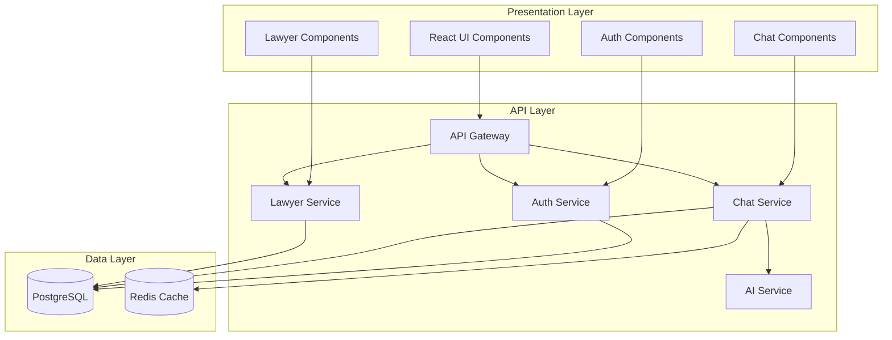

# Legal Navigator - Architectural Design Process

## 1. Architectural Requirements Analysis

### 1.1 Functional Requirements
- **User Authentication**: Secure login/registration with 2FA
- **AI Legal Chat**: Real-time chat with AI legal advisor
- **Lawyer Directory**: Search and filter lawyers by specialization
- **Multi-language Support**: English and French interfaces
- **Real-time Communication**: WebSocket-based chat system

### 1.2 Quality Attributes (Non-Functional Requirements)

#### Performance
- **Response Time**: < 2 seconds for 95% of requests
- **Throughput**: Support 1000 concurrent users
- **Scalability**: Horizontal scaling capability

#### Security
- **Authentication**: Multi-factor authentication
- **Data Protection**: Encryption at rest and in transit
- **Input Validation**: Prevent injection attacks
- **GDPR Compliance**: Data privacy and protection

#### Availability
- **Uptime**: 99.9% availability target
- **Fault Tolerance**: Graceful degradation
- **Disaster Recovery**: Backup and recovery procedures

#### Maintainability
- **Modularity**: Loosely coupled components
- **Testability**: Unit, integration, and E2E tests
- **Monitoring**: Comprehensive logging and metrics

## 2. Architecture Style Selection

### 2.1 Considered Styles

#### Layered Architecture
**Pros**:
- Clear separation of concerns
- Easy to understand and maintain
- Well-established patterns

**Cons**:
- Can become monolithic
- Performance overhead from layer transitions
- Tight coupling between layers

#### Microservices Architecture
**Pros**:
- Independent deployability
- Technology diversity
- Fault isolation

**Cons**:
- Increased complexity
- Network latency
- Data consistency challenges

#### Event-Driven Architecture
**Pros**:
- Loose coupling
- Scalability
- Real-time capabilities

**Cons**:
- Complex event flow
- Debugging challenges
- Eventual consistency

### 2.2 Selected Architecture: Modular Monolith with Event-Driven Components

**Rationale**:
Given the current team size, complexity requirements, and the need for real-time features, we chose a **Modular Monolith** approach with **Event-Driven** components for specific features like chat and notifications.

**Justification**:
1. **Simplicity**: Single deployment unit reduces operational complexity
2. **Performance**: No network overhead between modules
3. **Consistency**: ACID transactions across modules
4. **Real-time Capabilities**: Event-driven chat system
5. **Future Evolution**: Easy migration to microservices if needed

## 3. Component Architecture

### 3.1 High-Level Components

```
┌─────────────────────────────────────────────────────┐
│                 Presentation Layer                   │
├─────────────────────────────────────────────────────┤
│  React Frontend Components                          │
│  ├── Authentication Components                     │
│  ├── Chat Interface (WebSocket)                    │
│  ├── Lawyer Directory                              │
│  └── User Dashboard                                │
└─────────────────────────────────────────────────────┘
                           │
                    HTTP/WebSocket
                           │
┌─────────────────────────────────────────────────────┐
│                 Application Layer                    │
├─────────────────────────────────────────────────────┤
│  Express.js API Gateway                            │
│  ├── Authentication Service                        │
│  ├── Chat Service (Event-Driven)                   │
│  ├── Lawyer Service                                │
│  ├── User Service                                  │
│  └── AI Integration Service                        │
└─────────────────────────────────────────────────────┘
                           │
                      Database Layer
                           │
┌─────────────────────────────────────────────────────┐
│                   Data Layer                        │
├─────────────────────────────────────────────────────┤
│  PostgreSQL Database                               │
│  ├── Users & Authentication                        │
│  ├── Chat Sessions & Messages                      │
│  ├── Lawyer Profiles                               │
│  └── System Configuration                          │
└─────────────────────────────────────────────────────┘
```

### 3.2 Module Dependencies



## 4. Deployment Architecture

### 4.1 Current Deployment (Single Server)
```
┌─────────────────────────────────────────────────────┐
│                 Cloud Server                        │
├─────────────────────────────────────────────────────┤
│  ┌─────────────┐  ┌─────────────┐  ┌─────────────┐ │
│  │   Nginx     │  │ Node.js App │  │ PostgreSQL  │ │
│  │ (Reverse    │  │ (Port 5000) │  │ Database    │ │
│  │  Proxy)     │  │             │  │             │ │
│  └─────────────┘  └─────────────┘  └─────────────┘ │
└─────────────────────────────────────────────────────┘
```

### 4.2 Scalable Deployment (Kubernetes)
```
┌─────────────────────────────────────────────────────┐
│                 Kubernetes Cluster                  │
├─────────────────────────────────────────────────────┤
│  ┌─────────────┐  ┌─────────────┐  ┌─────────────┐ │
│  │   Ingress   │  │ App Pods    │  │  Database   │ │
│  │ Controller  │  │ (3 replicas)│  │   Service   │ │
│  └─────────────┘  └─────────────┘  └─────────────┘ │
│                                                     │
│  ┌─────────────┐  ┌─────────────┐  ┌─────────────┐ │
│  │   Redis     │  │ Prometheus  │  │   Grafana   │ │
│  │   Cache     │  │ Monitoring  │  │ Dashboard   │ │
│  └─────────────┘  └─────────────┘  └─────────────┘ │
└─────────────────────────────────────────────────────┘
```

## 5. Quality Attributes Analysis

### 5.1 Performance Characteristics

**Current Performance**:
- Database queries: < 100ms
- API response time: < 500ms
- WebSocket latency: < 50ms

**Optimization Strategies**:
- Database indexing on frequently queried fields
- Redis caching for session data
- CDN for static assets
- Gzip compression for API responses

### 5.2 Security Implementation

**Authentication & Authorization**:
- JWT tokens with refresh mechanism
- Role-based access control (User, Lawyer, Admin)
- Two-factor authentication (TOTP & Email)

**Data Protection**:
- bcrypt password hashing
- HTTPS encryption (TLS 1.3)
- Input validation and sanitization
- SQL injection prevention

### 5.3 Scalability Strategy

**Horizontal Scaling**:
- Stateless application design
- Database connection pooling
- Load balancing with session affinity
- Auto-scaling based on CPU/memory metrics

**Vertical Scaling**:
- Resource optimization
- Memory usage monitoring
- Database performance tuning

## 6. Trade-offs and Design Decisions

### 6.1 Monolith vs Microservices
**Decision**: Modular Monolith
**Trade-offs**:
- ✅ Simpler deployment and debugging
- ✅ Better performance (no network calls)
- ✅ ACID transactions
- ❌ Harder to scale individual components
- ❌ Technology lock-in

### 6.2 Real-time Communication
**Decision**: WebSockets with Socket.io
**Trade-offs**:
- ✅ Real-time bidirectional communication
- ✅ Built-in reconnection handling
- ✅ Room-based message broadcasting
- ❌ More complex than REST APIs
- ❌ Persistent connections consume resources

### 6.3 Database Choice
**Decision**: PostgreSQL
**Trade-offs**:
- ✅ ACID compliance
- ✅ Rich data types and JSON support
- ✅ Strong ecosystem and tooling
- ✅ Good performance for read/write workloads
- ❌ Vertical scaling limitations
- ❌ More complex than NoSQL for simple operations

## 7. Future Evolution Strategy

### 7.1 Migration to Microservices
**When**: When team size > 10 developers or clear service boundaries emerge
**Services to Extract**:
1. Authentication Service
2. AI/Chat Service
3. Notification Service
4. Analytics Service

### 7.2 Technology Upgrades
- **Frontend**: Migrate to Next.js for SSR
- **Backend**: Consider FastAPI for AI services
- **Database**: Add read replicas for scaling
- **Caching**: Implement Redis clustering

### 7.3 New Capabilities
- **Mobile Apps**: React Native or Flutter
- **AI Improvements**: Fine-tuned legal models
- **Analytics**: User behavior tracking
- **Integrations**: Third-party legal services
